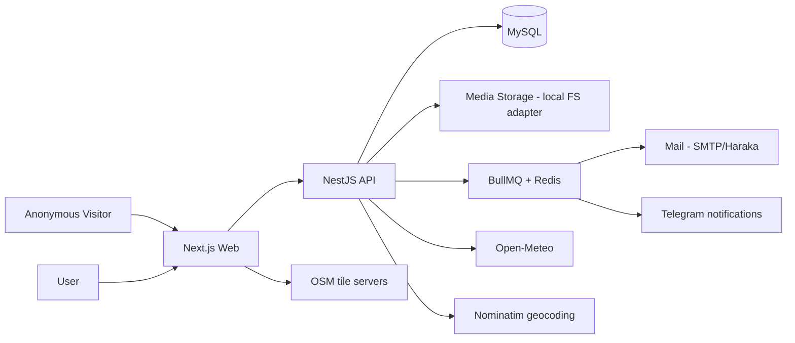
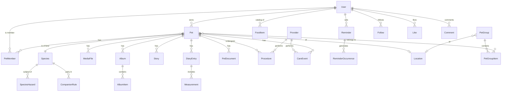

# Implementation Plan: Green and Fluffy

## 1. Overview

### Project Description

Green and Fluffy is a care platform for any living being — animals and plants alike: household pets, garden and farm plants, street trees, stray and wild animals. It provides pet/plant profiles with species catalog, Instagram-like photo albums and 24-hour stories, health diaries with measurements and vet documents, feeding/watering logs with reminders, locations with open-map boundaries and weather monitoring, a curated safety knowledge base ("this plant is toxic to cats"), and social features (follows, likes, comments, discovery feed).

The project heavily reuses the foundation of the sister project [myfinpro](https://github.com/Aleksei-Michnik/myfinpro): authentication (email + Google + Telegram), user management, timezone handling, monorepo scaffolding, and the entire VDS deployment infrastructure. Both projects run on the same VDS behind one shared Nginx until load justifies dedicated hosting.

**This is a public repository.** No secrets of any kind are ever committed. The app stores sensitive personal data (notably geo locations), so security and privacy are first-class requirements, not afterthoughts.

### Confirmed Scope Decisions

| Decision          | Choice                                                                                     |
| ----------------- | ------------------------------------------------------------------------------------------ |
| Architecture      | Mirror myfinpro: pnpm + Turborepo monorepo, NestJS API + Next.js web, Prisma + MySQL       |
| Auth              | Reuse myfinpro auth verbatim (email, Google, Telegram); Passkey/WebAuthn is a later phase  |
| Social features   | Full social in v1: albums, 24h stories, likes, comments, discovery feed                    |
| Species knowledge | Curated, versioned dataset shipped in the repo (public sources, e.g. ASPCA toxicity lists) |
| Public pages      | Visible to anonymous visitors, SEO-friendly; precise geo never public (coarse region only) |
| Locales           | en, he (RTL), ru, uk — fully translated from day one                                       |
| Media storage     | VDS local filesystem + per-user quotas, behind a storage-adapter interface (S3-ready)      |
| Telegram bot      | Later phase; send-only Telegram notifications come earlier (Phase 6)                       |
| Monetization      | None for now; AI monitoring as a possible future paid tier                                 |

### Technology Stack

| Layer              | Choice                                                                     | Notes                                                           |
| ------------------ | -------------------------------------------------------------------------- | --------------------------------------------------------------- |
| Monorepo           | pnpm 11 + Turborepo 2                                                      | pnpm's minimum-release-age supply-chain policy kept on          |
| Runtime            | Node.js 26 (Current; becomes LTS Oct 2026)                                 | `.nvmrc`, engines pinned                                        |
| Language           | TypeScript 6.x strict (7-ready)                                            | `packages/tsconfig` modernized for TS6 (nodenext, ES2025)       |
| Backend API        | NestJS 11 (latest)                                                         | Modular architecture, DTO validation, all auth logic            |
| Database           | MySQL 9.7 LTS + Prisma 7 (MariaDB driver adapter)                          | Latest LTS line; adapter pattern proven in myfinpro             |
| Frontend           | Next.js 16 (App Router) + React 19 + Tailwind 4                            | SSR for public pet pages (SEO)                                  |
| i18n               | next-intl (web)                                                            | Locales: en, he (RTL), ru, uk                                   |
| Auth               | Passport.js in NestJS, custom JWT (no next-auth)                           | Ported from myfinpro `apps/api/src/auth/`                       |
| Images             | sharp                                                                      | Resize/thumbnail variants at upload time                        |
| Maps               | Leaflet + react-leaflet + leaflet-geoman, OSM tiles                        | Open solutions; polygon drawing for fields/habitats             |
| Geocoding          | Nominatim (OSM)                                                            | Coarse public location names; respect usage policy (low volume) |
| Weather            | Open-Meteo API                                                             | Free, **no API key** — ideal for a public repo                  |
| Queue / scheduling | BullMQ + Redis                                                             | Reminder occurrences, weather polling, media cleanup            |
| Charts             | Recharts                                                                   | Measurement trends (weight/height)                              |
| Rate limiting      | @nestjs/throttler                                                          | Ported config, stricter on auth + upload endpoints              |
| API docs           | @nestjs/swagger                                                            | Disabled in production (as myfinpro)                            |
| Testing            | Jest + Supertest + Testcontainers, Vitest, Playwright                      | Same pyramid as myfinpro                                        |
| CI/CD              | GitHub Actions → GHCR → SSH deploy                                         | Workflows ported from myfinpro                                  |
| Hosting            | Shared VDS (with myfinpro), Docker Compose, shared Nginx, blue-green slots | `green-fluffy.michnik.pro` / `stage-green-fluffy.michnik.pro`   |

### Architecture Overview

Clients authenticate against the API which issues JWT access tokens (15 min) + rotating refresh tokens (httpOnly cookie) — identical to myfinpro. Public pet pages are server-rendered by Next.js with data from public API endpoints that structurally cannot return precise geo or private sections.

## 2. Reuse Strategy (from myfinpro)

**Decision: copy-and-adapt, not shared packages.** The two repos stay independent (separate deploys, separate release cadence, public repo hygiene). We copy proven code from myfinpro, rename branding, and keep file structure deliberately aligned so future fixes can be diffed across projects. No cross-repo runtime dependencies.

myfinpro currently contains _only_ foundation code (auth, users, groups, timezone, i18n, deployment) with zero finance-domain coupling — verified by inspection. Everything below ports cleanly.

### Reuse Map

| Subsystem                | myfinpro source (paths relative to its repo root)                                                                                                                                                                | How reused                                                                                                       |
| ------------------------ | ---------------------------------------------------------------------------------------------------------------------------------------------------------------------------------------------------------------- | ---------------------------------------------------------------------------------------------------------------- |
| Monorepo scaffold        | `pnpm-workspace.yaml`, `turbo.json`, root `package.json`, `.nvmrc`                                                                                                                                               | Copy, rename `@myfinpro/*` → `@green-fluffy/*`                                                                   |
| Shared configs           | `packages/tsconfig/`, `packages/eslint-config/`, `.prettierrc`                                                                                                                                                   | Copy as-is                                                                                                       |
| Shared types package     | `packages/shared/`                                                                                                                                                                                               | Copy skeleton (locales, pagination, API envelope DTOs, `isRTL`); drop currency constants; add `ru`, `uk` locales |
| Auth (API)               | `apps/api/src/auth/**` (controller, service, `services/*`, `strategies/*`, `guards/*`, `utils/telegram-auth.util.ts`, DTOs)                                                                                      | Copy; drop `defaultCurrency` from DTOs/responses                                                                 |
| Auth (web)               | `apps/web/src/lib/auth/*`, `apps/web/src/components/auth/*` (incl. `TelegramLoginButton.tsx`, `ProtectedRoute.tsx`), `apps/web/src/app/[locale]/auth/*`                                                          | Copy; restyle                                                                                                    |
| User schema              | `apps/api/prisma/schema.prisma` models: `User`, `RefreshToken`, `OAuthProvider`, `EmailVerificationToken`, `PasswordResetToken`, `AuditLog`                                                                      | Copy; drop `defaultCurrency`, add `avatarUrl`, `bio`, quota fields                                               |
| Timezone                 | `User.timezone` column, `UpdateProfileDto`, `apps/web/src/components/auth/TimezoneDetector.tsx`                                                                                                                  | Copy as-is                                                                                                       |
| Account lifecycle        | soft delete + grace period + reactivation: `services/account-deletion.service.ts`, `account-cleanup.service.ts`                                                                                                  | Copy; extend with pet transfer/deletion choice                                                                   |
| Mail                     | `apps/api/src/mail/mail.service.ts`, `infrastructure/haraka/`                                                                                                                                                    | Copy; re-brand templates; add ru/uk template variants; own DKIM key for our mail domain                          |
| Sharing/invites pattern  | `apps/api/src/group/**`, `Group*` models (invite tokens, roles, guards)                                                                                                                                          | **Adapt** into pet members + pet groups (same token/role mechanics)                                              |
| App bootstrap & security | `apps/api/src/main.ts` (helmet, CORS, cookie, trust proxy), `apps/api/src/common/throttler/*`, `config/*`, `health/*`                                                                                            | Copy                                                                                                             |
| i18n scaffolding         | `apps/web/src/i18n/*`, `messages/{en,he}.json`, `[locale]` layout                                                                                                                                                | Copy; extend to `en, he, ru, uk`                                                                                 |
| Docker                   | `infrastructure/docker/{api,web}.Dockerfile`, `docker-compose.yml` (dev)                                                                                                                                         | Copy, rename                                                                                                     |
| Deploy infra             | `docker-compose.shared-nginx.yml`, `docker-compose.{staging,production}.{infra,app}.yml`, `infrastructure/nginx/**`, `scripts/{deploy,rollback,cleanup-images,backup,verify-backup,check-backup-age,restore}.sh` | Copy, rename `myfinpro` → `green-fluffy`; **join the existing shared nginx** (see §8)                            |
| CI/CD workflows          | `.github/workflows/{ci,pr-check,deploy-staging,test-staging,deploy-production,backup-verify,infra-maintenance}.yml`                                                                                              | Copy, adjust image names, secrets, domains                                                                       |
| Server & ops docs        | `docs/server-setup-guide.md`, `docs/deployment.md`, `docs/blue-green-deployment.md`, `docs/backup.md`, `docs/phase-4-smtp-design.md`                                                                             | Reference + adapt                                                                                                |

### Porting Rules

1. Keep ported file paths identical to myfinpro where possible (eases cross-repo diffing and backporting fixes).
2. Rename all `myfinpro`/`MyFinPro` identifiers, container names, networks, volumes, GHCR image names to `green-fluffy`.
3. Drop finance-only surface (`defaultCurrency`, currency constants) at port time — do not carry dead code.
4. Every ported subsystem gets its tests ported with it; a port iteration is complete only when its tests pass in this repo.
5. Fixes discovered here that apply to myfinpro should be backported (note in PR description).
6. **Always use latest stable versions, verified online at port time** (npm registry, nodejs.org, Docker Hub) — never inherit myfinpro's older pins; adapt ported code to new-version breaking changes instead. (Applied at Phase 0: TypeScript 6, pnpm 11, Node 26, MySQL 9.7 LTS.)

## 3. Local Development Guide

### Prerequisites

- Node.js 24 (`nvm use`), pnpm 10, Docker + Docker Compose.

### Environment Setup

- Copy `.env.example` files (committed, values are placeholders only) to `.env` per app; never commit real values.
- `docker compose up -d` starts MySQL, Redis, mailpit (local mail catcher), nginx.
- `pnpm install && pnpm db:migrate && pnpm db:seed` (seed includes the species catalog + demo data).

### Running

- All: `pnpm dev` (turbo) or `docker compose up`.
- Single app: `pnpm --filter api dev`, `pnpm --filter web dev`.
- Tests: `pnpm test:unit`, `pnpm test:integration` (Testcontainers), `pnpm test:e2e` (Playwright).
- DB: `pnpm db:studio`, `pnpm db:reset`.

## 4. Cross-Cutting Concerns

### 4.1 Internationalization — 4 locales from day one

- **Locales**: `en` (default), `he` (RTL), `ru`, `uk`. All user-facing strings in `messages/{locale}.json` from the first UI iteration; hardcoded strings are a CI lint error (`next-intl` ESLint plugin / custom rule).
- **RTL**: CSS logical properties, `dir` from locale, RTL visual checks for `he`.
- **Definition of done for every UI iteration**: strings translated in all four files (machine-assisted translation reviewed by the maintainer is acceptable initially).
- **Species names**: the species catalog carries per-locale common names (`en/he/ru/uk`) with scientific name as fallback.
- Emails: templates in all four locales, keyed by `User.locale` (extends myfinpro's bilingual template pattern).

### 4.2 Timezone

- `User.timezone` (IANA string, default UTC) + client-side `TimezoneDetector` — ported from myfinpro.
- All timestamps stored UTC; all reminder schedules evaluated in the reminder's timezone (denormalized from user at creation, editable); all UI rendering via the user timezone.
- Weather/daylight data requested with the location's own timezone (Open-Meteo `timezone` parameter).

### 4.3 Media Pipeline

- **Storage adapter interface** (`StorageAdapter`: put/get/delete/stat/stream) with a local-FS implementation; S3 implementation is a future drop-in.
- Files live outside web root at `MEDIA_ROOT` (prod: bind mount `/opt/green-fluffy/<env>/media`), addressed by opaque storage keys (`<shard>/<uuid>.<ext>`), never by user-supplied names.
- **Upload flow**: authenticated multipart upload → MIME whitelist (magic-bytes check, not extension) → size limits (images 15 MB, videos 100 MB, documents 25 MB) → strip EXIF (GPS!) → sharp variants (`thumb` 256px, `medium` 1024px, `large` 2048px, original kept) → DB `MediaFile` row → quota accounting.
- **Serving**: all media through an API endpoint that enforces the pet/album/document visibility rules; public media additionally cacheable (long-lived cache headers + immutable keys). No direct filesystem exposure via nginx for private media.
- **Quotas**: per-user byte quota (default 1 GB, configurable per user), enforced at upload; usage visible in settings.
- **Video (v1)**: accept mp4/webm up to limit, no transcoding; poster frame via ffmpeg is a stretch iteration.

### 4.4 Geo Privacy (hard rules)

1. Precise coordinates and polygons are returned **only** to the owner and members of the pet/group.
2. Public API responses and SSR pages expose at most `city`/`region`/`country` (resolved once at save time via reverse geocoding and stored separately — public views never touch raw coordinates).
3. EXIF (incl. GPS) is stripped from all uploaded images at ingest.
4. Public/private serialization is enforced by **separate response DTO classes** (e.g. `PublicPetDto` has no location fields at the type level), not by runtime field filtering.
5. Audit log records changes to visibility settings and location data.

### 4.5 Pagination, Errors, Validation

- Cursor pagination everywhere (`{ data, cursor, hasMore }`), DTOs in `packages/shared` — ported pattern.
- Global NestJS exception filter with standardized error codes; React error boundaries + toasts.
- class-validator whitelist validation on every DTO; unknown fields stripped.

### 4.6 Database & Indexing

- Expand-then-contract migrations only (blue-green compatibility), same rules as myfinpro §8.3.
- Every entity table indexed for its list patterns: `(pet_id, occurred_at)` on diary/care events, `(owner_user_id, status)` on pets, `(published_at)` + `(pet_id, expires_at)` on stories, `(subject_type, subject_id)` on likes/comments, FULLTEXT on diary text + species names.
- Geo: point columns as `DECIMAL(9,6)` lat/lng; polygons as GeoJSON `JSON` column (MySQL spatial types optional later; not needed at this scale).

### 4.7 Testing Strategy

Same pyramid, tools, and coverage gates as myfinpro (Jest/Testcontainers for API, Vitest for web/shared, Playwright E2E + staging smoke suites; business logic ≥ 80%, overall ≥ 60%, PR diff ≥ 70%). Security-sensitive additions:

- **Access-control test matrix**: for every endpoint touching pets/media/diary — anonymous / non-member / viewer / caretaker / owner — asserting 401/403/filtered payloads. This suite is mandatory from Phase 4 on and runs in CI.
- **Geo privacy tests**: public serializers snapshot-tested to prove absence of precise geo fields.
- **Upload security tests**: MIME spoofing, oversize, quota, EXIF-strip verification.

### 4.8 Audit Logging

`AuditLog` (ported) records auth events, permission/visibility changes, location changes, document access, deletions, and moderation actions. Retention 90 days.

## 5. Security Architecture

### 5.1 Public Repository Policy

- No secrets in code, config, fixtures, tests, docs, or git history — ever. Only `.env.example` / `.env.*.template` files with placeholder values are committed.
- All real secrets live in GitHub Actions secrets (per environment) and are injected into the SSH deploy session (myfinpro model: **no `.env` files at rest on the server**; DKIM key written at deploy time, `chmod 600`).
- Secret scanning: GitHub secret scanning + push protection enabled; `gitleaks` job in CI as a second net.
- Dependabot/Renovate for dependency updates; `pnpm audit` in CI (fail on high severity).

### 5.2 Authentication & Session Security (ported)

- argon2id password hashing; JWT access 15 min; opaque refresh tokens SHA-256-hashed in DB, rotation with reuse detection, revoke-all on password change; httpOnly/secure/sameSite=strict cookies; Google OAuth with `state`; Telegram login HMAC-SHA256 verification with 24h freshness; strict throttling on auth endpoints; email verification and password reset token flows; soft-delete with 30-day grace.

### 5.3 Authorization Model

| Role (per pet/group)   | View private sections | Add diary/care/media | Edit profile, visibility, members | Delete/archive |
| ---------------------- | --------------------- | -------------------- | --------------------------------- | -------------- |
| Anonymous / non-member | public sections only  | —                    | —                                 | —              |
| Viewer                 | ✅ per grant          | —                    | —                                 | —              |
| Caretaker              | ✅                    | ✅                   | —                                 | —              |
| Owner                  | ✅                    | ✅                   | ✅                                | ✅             |

- Enforced server-side by NestJS guards (`PetAccessGuard(role)`) on every route; the UI merely reflects it.
- Per-section visibility on public pets: `photos | diary | feeding | location(coarse)` individually public/private; **documents and precise geo are never public**.

### 5.4 Content & Upload Security

- MIME whitelist by magic bytes, size caps, EXIF strip, quota, storage outside web root, authorization-checked serving (see §4.3); rate limits on upload endpoints; no SVG uploads (XSS vector) — raster + PDF + mp4/webm only.
- User text (comments, diary, captions) rendered as plain text / sanitized minimal markdown; CSP via helmet; output encoding everywhere.

### 5.5 Abuse, Spam & Brute-Force Protection

- Report queue for public content; owner-side comment moderation and per-user blocking; per-pet toggle for comments/likes; rate limits on comment/like/follow endpoints to deter spam; reduced limits for new (<24 h) accounts.
- Brute-force and query-abuse guards on **all** surfaces: strict throttles on auth (ported), posting, and upload endpoints; anonymous public-API throttling per IP; pagination caps and bounded query complexity on list endpoints; upload size/count limits per window.
- Crawler & AI-agent rules: `robots.txt` and `llms.txt` published for the public surface (public pet/group pages, sitemap allowed; app internals, private routes, and API disallowed).

### 5.6 Transport & Infrastructure

- Cloudflare in front (DNS + TLS) as with myfinpro; nginx routes by Host header; HTTPS enforced; Cloudflare real-IP config ported.
- Backups: nightly DB dump + media archive, restore-verification workflow (ported `backup-verify.yml` pattern), age alerting.

## 6. Data Model Overview

Full Prisma definitions live in the phase design documents; this is the map.

| Domain            | Models                                                                                              | Introduced in |
| ----------------- | --------------------------------------------------------------------------------------------------- | ------------- |
| Accounts (ported) | `User`, `RefreshToken`, `OAuthProvider`, `EmailVerificationToken`, `PasswordResetToken`, `AuditLog` | Phase 1       |
| Pets & species    | `Species`, `Pet` (owner types: user / municipality / none)                                          | Phase 2       |
| Media             | `MediaFile`, `Album`, `AlbumItem`                                                                   | Phase 3       |
| Sharing           | `PetMember`, `PetInviteToken`                                                                       | Phase 4       |
| Health            | `DiaryEntry`, `Measurement`, `PetDocument`, `Procedure`                                             | Phase 5       |
| Providers         | `Provider` (shared directory: clinics, vets, gardeners, organizations)                              | Phase 5       |
| Care              | `FoodItem`, `CareEvent`, `Reminder`, `ReminderOccurrence`, `NotificationPreference`                 | Phase 6       |
| Geo & weather     | `Location`, `WeatherAlertRule`, weather cache                                                       | Phase 7       |
| Groups            | `PetGroup`, `PetGroupItem`, group members/invites                                                   | Phase 8       |
| Knowledge base    | `SpeciesHazard`, `CompanionRule`, `CareGuideline`, `WarningDismissal`                               | Phase 9       |
| Social            | `Follow`, `Like`, `Comment`, `Report`, `UserBlock`, `ActivityEvent`                                 | Phase 10      |
| Stories           | `Story`                                                                                             | Phase 11      |

## 7. Phases and Iterations

Each iteration is small, deployable, tested, and ships behind CI. Detailed step-by-step instructions per phase live in `docs/phase-N-design.md`.

### Phase Summary

| Phase | Title                                                | Size          | Design doc                                         |
| ----- | ---------------------------------------------------- | ------------- | -------------------------------------------------- |
| 0     | Foundation: scaffold, CI/CD, environments            | 10 iterations | [docs/phase-0-design.md](docs/phase-0-design.md)   |
| 1     | Accounts: auth, profile, timezone, legal (ported)    | 10            | [docs/phase-1-design.md](docs/phase-1-design.md)   |
| 2     | Pet profiles & species catalog                       | 8             | [docs/phase-2-design.md](docs/phase-2-design.md)   |
| 3     | Media foundation: uploads, albums, quotas            | 9             | [docs/phase-3-design.md](docs/phase-3-design.md)   |
| 4     | Access control, sharing & public pages               | 9             | [docs/phase-4-design.md](docs/phase-4-design.md)   |
| 5     | Health diary, procedures, documents & care providers | 16            | [docs/phase-5-design.md](docs/phase-5-design.md)   |
| 6     | Feeding & care, reminders, notifications             | 10            | [docs/phase-6-design.md](docs/phase-6-design.md)   |
| 7     | Locations, maps & weather                            | 8             | [docs/phase-7-design.md](docs/phase-7-design.md)   |
| 8     | Pet groups: patches, fields, tanks, colonies         | 8             | [docs/phase-8-design.md](docs/phase-8-design.md)   |
| 9     | Knowledge base: warnings & recommendations           | 9             | [docs/phase-9-design.md](docs/phase-9-design.md)   |
| 10    | Social: follows, likes, comments, feed               | 9             | [docs/phase-10-design.md](docs/phase-10-design.md) |
| 11    | Stories                                              | 6             | [docs/phase-11-design.md](docs/phase-11-design.md) |
| 12    | Data export & privacy dashboard                      | 4             | [docs/phase-12-design.md](docs/phase-12-design.md) |
| 13+   | Future: Telegram bot, mini app, passkey, sensors, AI | outline       | [docs/future-phases.md](docs/future-phases.md)     |

**Total core scope: 116 iterations.** Recommended order is as listed; Phases 6 and 7 are independent of each other and can swap; Phase 9 needs Phases 2, 6 + 8 (it reasons over species, placements, care logs, and group co-location); Phases 10–11 need Phases 3 + 4.

### Phase 0: Foundation

| Iteration | Objective               | Scope                                                                                                                                                                                             | Acceptance                                                                             |
| --------- | ----------------------- | ------------------------------------------------------------------------------------------------------------------------------------------------------------------------------------------------- | -------------------------------------------------------------------------------------- |
| 0.1       | Monorepo scaffold       | Port pnpm+turbo skeleton, `packages/{tsconfig,eslint-config,shared}`, prettier, `.nvmrc`; rename to `@green-fluffy/*`                                                                             | `pnpm lint && pnpm typecheck && pnpm build` green                                      |
| 0.2       | API skeleton            | NestJS app ported from myfinpro bootstrap (helmet, CORS, cookies, trust proxy, config, health module, throttler, pino, Swagger `/api/docs`, `/api/v1` prefix)                                     | `/api/v1/health` returns ok; Swagger renders                                           |
| 0.3       | Web skeleton + i18n×4   | Next.js app with `[locale]` routing, next-intl for en/he/ru/uk, RTL for he, theme switcher (dark/light), base layout                                                                              | All 4 locales render; `he` is RTL                                                      |
| 0.4       | Local dev stack         | `docker-compose.yml`: mysql 8.4, redis, mailpit, nginx; Prisma init with `HealthCheck` model; seed script skeleton                                                                                | `docker compose up` + migrate + seed works, documented in README                       |
| 0.5       | CI                      | Port `ci.yml` (lint, typecheck, prettier, unit, build) + `pr-check.yml` (conventional-commit PR titles) + gitleaks job                                                                            | PRs blocked on red CI                                                                  |
| 0.6       | Server provisioning     | Create `/opt/green-fluffy/{staging,production}` on the VDS, docker networks, DNS records in Cloudflare for both subdomains, GitHub environments + secrets (names documented in `.env.*.template`) | Subdomains resolve; secrets in place; nothing sensitive in repo                        |
| 0.7       | Staging CD              | Port `deploy-staging.yml`, `deploy.sh`, `rollback.sh`, compose `{infra,app}` files; join existing shared nginx (`docker network connect` + `conf.d/green-fluffy-staging.conf`, see §8.2)          | Blue-green deploy to `stage-green-fluffy.michnik.pro` works twice in a row (slot flip) |
| 0.8       | Production CD           | Port `deploy-production.yml` with staging-tests gate                                                                                                                                              | Production live at `green-fluffy.michnik.pro` with placeholder page                    |
| 0.9       | Backups + observability | Port backup scripts + `backup-verify.yml` (extended to media dir), health checks, structured logs, deploy notifications                                                                           | Backup created, restore-verified, age-alerting active                                  |
| 0.10      | Staging smoke tests     | Port `test-staging.yml` + minimal API/E2E staging suites                                                                                                                                          | Staging suite gates production deploy                                                  |

### Phase 1: Accounts (Ported Auth)

| Iteration | Objective                           | Scope                                                                                                                                                                 | Acceptance                                        |
| --------- | ----------------------------------- | --------------------------------------------------------------------------------------------------------------------------------------------------------------------- | ------------------------------------------------- |
| 1.1       | Auth schema                         | Port `User` (minus currency, plus `avatarUrl`, `bio`, `mediaQuotaBytes`), `RefreshToken`, `OAuthProvider`, `EmailVerificationToken`, `PasswordResetToken`, `AuditLog` | Migration applied on staging                      |
| 1.2       | Email+password auth                 | Port register/login/refresh/logout/me + argon2 + token service + rotation + guards + strategies + their tests                                                         | Full auth API green incl. ported tests            |
| 1.3       | Mail service                        | Port mail module + Haraka container + DKIM/SPF/DMARC DNS for the mail domain; templates re-branded, ×4 locales                                                        | Verification email lands in real inbox, DKIM pass |
| 1.4       | Email verification + password reset | Port flows + pages                                                                                                                                                    | E2E: register → verify → reset works              |
| 1.5       | Google OAuth                        | Port strategy/guard/callback; new Google OAuth app (staging + prod)                                                                                                   | Google login round-trip on staging                |
| 1.6       | Telegram login                      | Port HMAC verification + widget button; new bots (`@GreenFluffyBot`, stage bot)                                                                                       | Telegram login works; linking works               |
| 1.7       | Auth UI                             | Port login/register/callback pages + auth context + ProtectedRoute; restyle to green-fluffy brand                                                                     | E2E login/register in all 4 locales               |
| 1.8       | Profile & settings                  | Port settings page: name, avatar (placeholder until Phase 3), bio, timezone (+ `TimezoneDetector`), locale, connected accounts, change password                       | Profile editable; timezone auto-detected          |
| 1.9       | Account deletion                    | Port soft-delete + grace + scheduler; pet handling choice deferred-stubbed                                                                                            | Delete/cancel/reactivate flows work               |
| 1.10      | Legal + consent                     | Terms + privacy pages (×4 locales, geo-data specifics), registration consent checkbox, footer                                                                         | Legal pages live; consent required                |

### Phase 2: Pet Profiles & Species Catalog

| Iteration | Objective               | Scope                                                                                                                                                                    | Acceptance                                       |
| --------- | ----------------------- | ------------------------------------------------------------------------------------------------------------------------------------------------------------------------ | ------------------------------------------------ |
| 2.1       | Species schema + seed   | `Species` model (category animal/plant, hierarchy, per-locale common names, attributes); versioned seed dataset (~200 common species/breeds) in `packages/species-data`  | Seed idempotent; species searchable in 4 locales |
| 2.2       | Species API             | Search/list/get endpoints with locale-aware matching + FULLTEXT                                                                                                          | Autocomplete-quality search                      |
| 2.3       | Pet schema              | `Pet` model: category, speciesId + custom text fallback, owner type (user/municipality/none), names/aliases, sex, birth date + precision, description, status, placement | Migration applied                                |
| 2.4       | Pet CRUD API            | Create/get/update/archive/delete + owner-only guards + audit                                                                                                             | CRUD with tests incl. access matrix              |
| 2.5       | Pet create/edit UI      | Multi-step form: category → species picker → details; owner type selection                                                                                               | Pet creatable in all locales                     |
| 2.6       | My pets dashboard       | Pet list with cards, filters (category/status), archive view                                                                                                             | Dashboard usable on mobile                       |
| 2.7       | Pet page v1             | Private pet profile page (info sections; placeholders for photos/diary)                                                                                                  | Pet page renders                                 |
| 2.8       | Aliases & archive flows | Multiple names/aliases; archive with reason (deceased/sold/released/removed)                                                                                             | Archived pets preserved, excluded from actives   |

### Phase 3: Media Foundation

| Iteration | Objective                | Scope                                                                                                | Acceptance                                              |
| --------- | ------------------------ | ---------------------------------------------------------------------------------------------------- | ------------------------------------------------------- |
| 3.1       | Storage adapter + schema | `StorageAdapter` interface + local FS impl + `MediaFile` model + media root volume in compose/deploy | Files stored under opaque keys                          |
| 3.2       | Upload API               | Multipart upload: magic-byte MIME whitelist, size caps, EXIF strip, sharp variants, quota check      | Upload security tests green (spoof/oversize/quota/EXIF) |
| 3.3       | Serving API              | Streaming endpoint with visibility enforcement + cache headers                                       | Private media 403s for non-members                      |
| 3.4       | Pet gallery              | Upload/list/delete photos on pet page; set pet avatar; lightbox                                      | Gallery works on mobile                                 |
| 3.5       | Albums API               | `Album`/`AlbumItem` CRUD, cover, ordering, captions                                                  | Album CRUD tested                                       |
| 3.6       | Albums UI                | Instagram-like album grid + album view + manage                                                      | Albums browsable                                        |
| 3.7       | User avatar + quota UI   | Avatar upload (crops via sharp); storage usage bar in settings                                       | Quota visible and enforced                              |
| 3.8       | Video support            | mp4/webm upload within caps; inline player; (stretch: ffmpeg poster frame)                           | Video plays in gallery                                  |
| 3.9       | Media backups + cleanup  | Media dir in backup archive + orphan/deleted-file cleanup job (BullMQ)                               | Restore test includes media                             |

### Phase 4: Access Control, Sharing & Public Pages

| Iteration | Objective            | Scope                                                                                                                                       | Acceptance                                   |
| --------- | -------------------- | ------------------------------------------------------------------------------------------------------------------------------------------- | -------------------------------------------- |
| 4.1       | Membership schema    | `PetMember` (viewer/caretaker) + `PetInviteToken` (adapted from myfinpro group models, SHA-256 tokens, 7-day expiry)                        | Migration applied                            |
| 4.2       | Access guards        | `PetAccessGuard(minRole)` + retrofit onto all existing pet/media endpoints                                                                  | Access-control matrix suite green            |
| 4.3       | Invites API + UI     | Create/revoke invite links, accept-invite page, member list, role change, removal                                                           | Invite flow E2E                              |
| 4.4       | Visibility model     | `isPublic` + per-section visibility (photos/diary/feeding/location-coarse); settings UI                                                     | Visibility changes audit-logged              |
| 4.5       | Public DTOs          | Separate `PublicPetDto` serializers (no precise geo at type level) + public API endpoints (anonymous, cacheable, rate-limited)              | Geo-privacy snapshot tests green             |
| 4.6       | Public pet page      | SSR public page: profile, public albums/gallery, coarse location, OpenGraph/meta, sitemap, `robots.txt` + `llms.txt` crawler/AI-agent rules | Anonymous browsing works; SEO checks pass    |
| 4.7       | Shared-with-me       | Members see shared pets in dashboard; caretaker write paths verified                                                                        | Caretaker can add content, viewer cannot     |
| 4.8       | Deletion integration | Account deletion: choose transfer pets to member or delete; orphaned-pet handling                                                           | Grace-period deletion handles pets correctly |
| 4.9       | Hardening pass       | Fuzz public endpoints, rate limits, cache rules, robots.txt, noindex for borderline views                                                   | Security checklist signed off                |

### Phase 5: Health Diary, Procedures, Documents & Care Providers

The pet's diary is the **unified timeline of everything** that happens to it — health entries, life events, procedures, and (from Phase 6) routine care events like feeding/watering, each attributed to the pet with its details (time, quantity, catalog item, performer).

#### 5A: Health Diary & Documents

| Iteration | Objective                  | Scope                                                                                                                                                                                                                                                               | Acceptance                                           |
| --------- | -------------------------- | ------------------------------------------------------------------------------------------------------------------------------------------------------------------------------------------------------------------------------------------------------------------- | ---------------------------------------------------- |
| 5.1       | Diary schema               | `DiaryEntry` (types: condition/symptom/measurement/treatment/vaccination/vet_visit/procedure/observation/note/event), event kinds (birth/trauma/grooming/flowering/fruiting/pest/disaster: drought/hurricane/hail/fire/flood/vandalism), `Measurement`, media links | Migration applied                                    |
| 5.2       | Diary API                  | CRUD + caretaker permissions + audit + cursor pagination + filters (type/date/text FULLTEXT)                                                                                                                                                                        | API tested incl. access matrix                       |
| 5.3       | Diary timeline UI          | Timeline with type/event-kind icons, filters, search                                                                                                                                                                                                                | Timeline usable on mobile                            |
| 5.4       | Entry composer             | Type-aware form (structured details per type incl. event kinds), photo attach (→ optionally also gallery)                                                                                                                                                           | Entry with photos created ≤ 1 min                    |
| 5.5       | Measurements & charts      | Weight/height/girth/temp series; Recharts trends with unit handling                                                                                                                                                                                                 | Chart renders series correctly                       |
| 5.6       | Documents schema + API     | `PetDocument` (passport/chip/pedigree/medical/prescription/lab), chip number search, scans via media pipeline, always-private                                                                                                                                       | Documents CRUD; never on public views                |
| 5.7       | Documents UI               | Documents section with previews (PDF/image), structured fields (numbers, dates, issuer)                                                                                                                                                                             | Vet doc attachable to a diary entry                  |
| 5.8       | Diary visibility           | Per-entry visibility (private/members/public) within pet's diary section visibility                                                                                                                                                                                 | Public sees only public entries of public-diary pets |
| 5.9       | Vaccination/treatment view | Filtered registry ("all vaccinations"), due-status surface (feeds Phase 6 reminders)                                                                                                                                                                                | Registry view works                                  |

#### 5B: Procedures Lifecycle

| Iteration | Objective              | Scope                                                                                                                                                                                                                              | Acceptance                                      |
| --------- | ---------------------- | ---------------------------------------------------------------------------------------------------------------------------------------------------------------------------------------------------------------------------------- | ----------------------------------------------- |
| 5.10      | Procedure schema + API | `Procedure` (kind: castration/surgery/dental/grooming-procedure/cutting/grafting/repotting/…; status: recommended/planned/done/cancelled; source: kb/vet/user; scheduled/performed dates; performer attribution; documents/photos) | Lifecycle transitions tested                    |
| 5.11      | Procedures UI          | Procedures tab: recommended/planned/history lists; plan → schedule (reminder hook, Phase 6); complete → linked diary entry with docs/photos/vet info                                                                               | Castration planned → done → in diary E2E        |
| 5.12      | Plant procedures       | Cutting/grafting/repotting flows with performer (owner/gardener/worker) attribution                                                                                                                                                | Plant procedure recorded with non-vet performer |

#### 5C: Care Providers Directory (shared)

| Iteration | Objective             | Scope                                                                                                                                                                                                                       | Acceptance                                                      |
| --------- | --------------------- | --------------------------------------------------------------------------------------------------------------------------------------------------------------------------------------------------------------------------- | --------------------------------------------------------------- |
| 5.13      | Provider schema + API | Shared `Provider` (vet_clinic/vet/gardener/pond_org/aquarium_caretaker/farm_service/other) with links (website, Google Business), address/coarse geo, dedup by name+locality; suggest-correction flow (maintainer-reviewed) | Provider CRUD + dedup tested                                    |
| 5.14      | Provider attribution  | `providerId` on vet visits, procedures, care events; picker UI (search shared directory + inline add)                                                                                                                       | Vet visit attributed to clinic; gardener attributed to cutting  |
| 5.15      | Directory UI          | Provider directory page (search by kind/name/locality), provider page with links (no testimonials/ratings)                                                                                                                  | Directory browsable; links open                                 |
| 5.16      | Open-data sync        | Importer actualizing providers from open sources (OSM `amenity=veterinary` etc.): match/merge by name+geo, provenance kept, user data never overwritten silently                                                            | Sync idempotent on staging fixture; conflicts queued for review |

### Phase 6: Feeding & Care, Reminders, Notifications

| Iteration | Objective                | Scope                                                                                                                                                                         | Acceptance                                          |
| --------- | ------------------------ | ----------------------------------------------------------------------------------------------------------------------------------------------------------------------------- | --------------------------------------------------- |
| 6.1       | Care schema              | `FoodItem` (user catalog), `CareEvent` (feeding/watering/fertilizing/medication/grooming/repotting/pruning/…)                                                                 | Migration applied                                   |
| 6.2       | Care log API + UI        | Quick-log entry (select/add food inline, time + quantity + unit), per-pet history, edit/delete; **care events appear in the pet's unified diary timeline** with their details | Feeding logged in ≤ 3 taps and visible in the diary |
| 6.3       | Queue infrastructure     | BullMQ + Redis wiring (first real Redis use), repeatable jobs, dead-letter handling                                                                                           | Jobs visible/processed; survives deploy slot flip   |
| 6.4       | Reminder schema + engine | `Reminder` (RRULE schedule, timezone-aware) + `ReminderOccurrence` generation job; DST-safe                                                                                   | Occurrences generated correctly across DST          |
| 6.5       | Reminder API + UI        | CRUD, per-pet and global "today" view, done (auto-creates care/diary entry) / snooze / skip                                                                                   | Done-flow writes history                            |
| 6.6       | Email notifications      | Notification dispatcher job → mail service; ×4 locale templates                                                                                                               | Reminder email delivered                            |
| 6.7       | Telegram notifications   | Send-only bot delivery to users with linked Telegram; opt-in                                                                                                                  | Telegram reminder delivered                         |
| 6.8       | Notification preferences | Per-channel × per-category matrix in settings; `NotificationPreference`                                                                                                       | Preferences honored                                 |
| 6.9       | Health reminders         | Vaccination/vet-visit reminder templates from Phase 5 registry                                                                                                                | Vet reminder round-trip                             |
| 6.10      | Digest & quiet hours     | Daily digest option; quiet hours in user timezone                                                                                                                             | Digest respects timezone                            |

### Phase 7: Locations, Maps & Weather

| Iteration | Objective                | Scope                                                                                                    | Acceptance                              |
| --------- | ------------------------ | -------------------------------------------------------------------------------------------------------- | --------------------------------------- |
| 7.1       | Location schema          | `Location` (point DECIMAL lat/lng, polygon GeoJSON, address + stored coarse fields: city/region/country) | Migration applied                       |
| 7.2       | Map picker               | Leaflet + OSM tiles: point picker with address search (Nominatim, debounced, attributed)                 | Location settable on pet                |
| 7.3       | Reverse geocoding        | Save-time coarse resolution (city/region/country) stored separately for public use                       | Public page shows only coarse name      |
| 7.4       | Placement                | Sun/partial/shade/indoor placement on pets (plants primarily)                                            | Placement editable, shown on profile    |
| 7.5       | Open-Meteo client        | API client (no key) with caching (Redis, per lat/lng rounded), forecast + daily daylight/UV              | Weather cached; rate-safe               |
| 7.6       | Weather UI               | Weather card on located pets/groups: current, 7-day, daylight, UV                                        | Card renders for outdoor plant          |
| 7.7       | Weather alerts           | `WeatherAlertRule` job: frost/heat/storm/dry-spell checks → notification pipeline                        | Frost alert triggers on staging fixture |
| 7.8       | Geo privacy verification | Full sweep: precise geo absent from every public surface (API, SSR, sitemap, OG images)                  | Geo test suite green                    |

### Phase 8: Pet Groups

| Iteration | Objective           | Scope                                                                                                                                            | Acceptance                          |
| --------- | ------------------- | ------------------------------------------------------------------------------------------------------------------------------------------------ | ----------------------------------- |
| 8.1       | Group schema        | `PetGroup` (type: patch/field/greenhouse/tank/aviary/enclosure/household/colony/herd/other; headcount for uncounted populations), `PetGroupItem` | Migration applied                   |
| 8.2       | Group CRUD API + UI | Create/edit groups, add/move pets, headcount, group page                                                                                         | Group manageable                    |
| 8.3       | Group sharing       | Members/invites/visibility for groups (same mechanics as pets)                                                                                   | Access matrix green for groups      |
| 8.4       | Boundaries on map   | Polygon drawing (leaflet-geoman) for fields/patches/habitats; area computation                                                                   | Field boundary drawable + saved     |
| 8.5       | Group care events   | Group-level feeding/watering/fertilizing with history                                                                                            | One entry covers the field          |
| 8.6       | Group reminders     | Reminders attached to groups                                                                                                                     | Watering reminder for a patch works |
| 8.7       | Group weather       | Weather + alerts on group location (polygon centroid)                                                                                            | Frost alert for a field             |
| 8.8       | Group public pages  | Public group page with coarse location, member pets                                                                                              | Public tank page renders            |

### Phase 9: Knowledge Base — Warnings & Recommendations

| Iteration | Objective                 | Scope                                                                                                                                                                                                               | Acceptance                                                         |
| --------- | ------------------------- | ------------------------------------------------------------------------------------------------------------------------------------------------------------------------------------------------------------------- | ------------------------------------------------------------------ |
| 9.1       | KB schema + dataset       | `SpeciesHazard`, `CompanionRule`, `CareGuideline`; curated dataset in `packages/species-data` with source citations (ASPCA etc.), versioned + validated in CI                                                       | Dataset loads; sources present for every rule                      |
| 9.2       | Hazard engine             | Rule evaluation: toxic-plant × animal in same household/group; water-toxic plant × tank/pond group; reach heuristics (indoor placement)                                                                             | Unit-tested rule engine                                            |
| 9.3       | Companion engine          | Plant×plant good/bad companions in same pot/patch/soil context                                                                                                                                                      | Companion warnings computed                                        |
| 9.4       | Warnings API + dashboard  | "My green and fluffy" panel: active warnings with severity, reason, and source link; `WarningDismissal`                                                                                                             | Warning appears when toxic plant added to cat household            |
| 9.5       | Recommendations           | Care recommendations from `CareGuideline` × species × placement × season × local weather; explicit **soil kind** and **watering period** guidance for plants (weather-adjusted outdoors, in-house baseline indoors) | Seasonal + soil + watering advice shown                            |
| 9.6       | KB contribution flow      | Maintainer pipeline for extending dataset (PR-based, schema-validated, CI-checked)                                                                                                                                  | Docs + validation for contributions                                |
| 9.7       | Warning notifications     | New-warning notifications (respecting preferences)                                                                                                                                                                  | Notification on new hazard                                         |
| 9.8       | Procedure recommendations | `ProcedureRule` dataset (species × sex → recommended/must procedures, e.g. castration for cats/dogs/rodents) feeding Phase 5B recommended-procedures list                                                           | Cat fixture shows castration as recommended                        |
| 9.9       | Care-deviation warnings   | Compare care log (Phase 6) against guidelines: over/under feeding & watering detection with grace thresholds; weather-aware for outdoor plants                                                                      | Under-watering fixture triggers warning; well-cared fixture silent |

### Phase 10: Social — Follows, Likes, Comments, Feed

| Iteration | Objective            | Scope                                                                                                                                             | Acceptance                                                           |
| --------- | -------------------- | ------------------------------------------------------------------------------------------------------------------------------------------------- | -------------------------------------------------------------------- |
| 10.1      | Social schema        | `Follow`, `Like`, `Comment`, `Report`, `UserBlock`, `ActivityEvent` (publish-time events for public content)                                      | Migration applied                                                    |
| 10.2      | Follows              | Follow pets/users; follower counts; follows list; **same-kind suggestions** (public pets of the same species/breed as mine) on feed and pet pages | Follow round-trip; Maine Coon owner sees other Maine Coons suggested |
| 10.3      | Likes                | Like public photos/entries; counts; rate-limited                                                                                                  | Likes work, spam-limited                                             |
| 10.4      | Comments             | Threaded (1 level) comments on public content; sanitized rendering                                                                                | Comments post + render safely                                        |
| 10.5      | Moderation           | Owner delete/block; per-pet toggles for comments/likes; report queue + admin view                                                                 | Owner controls effective                                             |
| 10.6      | Discovery feed       | Logged-in feed: followed-first + recent public activity; cursor-paginated; SSR-friendly                                                           | Feed loads < 300ms p95 on VDS                                        |
| 10.7      | Pet social surfaces  | Counts + comment sections on public pet pages                                                                                                     | Public page shows social layer                                       |
| 10.8      | Social notifications | New comment/follow notifications (preference-gated)                                                                                               | Notifications delivered                                              |
| 10.9      | Anti-abuse pass      | Throttles, block semantics everywhere, report SLA doc, banned-user handling                                                                       | Abuse checklist signed off                                           |

### Phase 11: Stories

| Iteration | Objective           | Scope                                                                                                   | Acceptance                                               |
| --------- | ------------------- | ------------------------------------------------------------------------------------------------------- | -------------------------------------------------------- |
| 11.1      | Story schema + API  | `Story` (media, caption, 24h expiry), create/list/view; archive after expiry (visible to pet's members) | Story lifecycle tested                                   |
| 11.2      | Story composer      | Camera/gallery capture, caption, publish                                                                | Story publishable from phone                             |
| 11.3      | Story viewer        | Tap-through viewer with progress bars (the Instagram pattern)                                           | Viewer works with keyboard + touch                       |
| 11.4      | Stories in feed     | Story rail on feed + public pet pages (public pets only)                                                | Rail shows unseen-first                                  |
| 11.5      | Expiry & archive    | Expiry job (BullMQ), archive view for owner/members                                                     | Stories disappear publicly after 24h, archived privately |
| 11.6      | Story notifications | Optional new-story notifications for followers                                                          | Preference-gated delivery                                |

### Phase 12: Data Export & Privacy Dashboard

| Iteration | Objective         | Scope                                                                                         | Acceptance                          |
| --------- | ----------------- | --------------------------------------------------------------------------------------------- | ----------------------------------- |
| 12.1      | Export API        | Async export job: JSON + media archive (zip) per user, download link with expiry              | Export contains all user data       |
| 12.2      | Export UI         | Settings section: request export, history, download                                           | Export round-trip ≤ 10 min          |
| 12.3      | Privacy dashboard | Overview: what's public, who has access to what, active sessions, audit trail view            | User can answer "who sees my data?" |
| 12.4      | Retention polish  | Verify deletion cascades (pets/media/social) + document data retention policy in privacy page | Deletion leaves no orphans          |

### Future Phases (outline — see [docs/future-phases.md](docs/future-phases.md))

- **Phase 13 — Telegram bot**: interactive grammy.js bot (adapt myfinpro `apps/bot` scaffold): conversational care logging, photo-to-diary, reminder done/snooze from chat.
- **Phase 14 — Telegram mini app**: mobile-first pet browsing + quick logging.
- **Phase 15 — Passkey/WebAuthn**: passwordless login (new, not ported).
- **Phase 16 — Smart systems & sensors**: device registry, MQTT/HTTP ingestion, sensor charts, threshold alerts, feeder/waterer events into care history.
- **Phase 17 — AI monitoring (possible paid tier)**: analysis of uploaded photos for early problem detection (yellowing leaves, infestation, skin conditions), symptom photo triage, anomaly detection on measurements/sensors, care plan suggestions; monetization decisions follow validation.

## 8. Deployment Strategy

### 8.1 Environments

| Item          | Strategy                                                                                                                   |
| ------------- | -------------------------------------------------------------------------------------------------------------------------- |
| Environments  | staging + production on the **same VDS as myfinpro**, Docker Compose, blue-green slots                                     |
| Domains       | `stage-green-fluffy.michnik.pro`, `green-fluffy.michnik.pro` — Cloudflare DNS + TLS (as myfinpro; configured in Phase 0.6) |
| Images        | GitHub Actions → GHCR (`ghcr.io/<owner>/green-fluffy/{api,web}`), tagged per env + SHA                                     |
| Branch model  | `develop` → auto-deploy staging; `main` → production (gated by staging test recency, ported mechanism)                     |
| Server layout | `/opt/green-fluffy/{staging,production}` + media dirs; state files per env (`.active-slot`)                                |
| Migrations    | Prisma `migrate deploy` during slot start; expand-then-contract mandatory                                                  |
| Rollback      | Slot-switch rollback with preserved N-1 images (ported `rollback.sh`)                                                      |

### 8.2 Shared Nginx Integration (key VDS decision)

Ports 80/443 on the VDS are held by myfinpro's shared nginx (`myfinpro-nginx`, attached to both myfinpro networks, routing by `Host`). Green-fluffy **joins that shared nginx** rather than running its own:

1. Green-fluffy creates its own external networks: `green-fluffy-staging-net`, `green-fluffy-production-net`.
2. Deploy script idempotently runs `docker network connect <net> myfinpro-nginx` (no changes required in the myfinpro repo; optionally later, myfinpro's `docker-compose.shared-nginx.yml` adds the networks declaratively and the nginx project is renamed to a neutral `shared` project — tracked as a cross-repo chore).
3. Green-fluffy renders its own vhosts from a ported `ssl.conf.template` into the shared `conf.d/` (`green-fluffy-staging.conf`, `green-fluffy-production.conf`) with env-prefixed upstreams (`green-fluffy-${ENVIRONMENT}-api-${ACTIVE_SLOT}` etc.), then `nginx -t && nginx -s reload`.
4. Blue-green slot switching works exactly as in myfinpro — per project, independently.
5. `client_max_body_size` for green-fluffy vhosts raised to fit media uploads (110 MB, above the app-level 100 MB video cap).

Each project keeps its **own** MySQL, Redis, and Haraka containers per environment (isolation, independent lifecycle). If VDS RAM becomes tight, consolidation to shared DB instances with separate schemas is the documented fallback.

### 8.3 Required GitHub Secrets (names only — never values)

Same catalog as myfinpro with green-fluffy values: SSH (`STAGING_HOST/USER/SSH_KEY`, prod variants), domains (`CLOUDFLARE_STAGING_SUBDOMAIN`, `CLOUDFLARE_PRODUCTION_SUBDOMAIN`), DB (`MYSQL_*`), JWT/session (`JWT_SECRET`, `JWT_REFRESH_SECRET`, `SESSION_SECRET`, `COOKIE_SECRET`), OAuth (`GOOGLE_CLIENT_ID/SECRET/CALLBACK_URL` — new OAuth app), Telegram (`TELEGRAM_BOT_TOKEN[/_STAGE]`, `TELEGRAM_BOT_USERNAME[/_STAGE]`, `NEXT_PUBLIC_TELEGRAM_BOT_ID` — new bots), mail (`SMTP_*`, `MAIL_DOMAIN`, `DKIM_PRIVATE_KEY`), Redis (`REDIS_*`). Documented in `.env.staging.template` / `.env.production.template` with placeholders.

### 8.4 Scaling Path

Run on the shared VDS while load is low (monitor RAM/CPU/disk — media grows!). Triggers to move: sustained resource pressure, media storage growth beyond VDS disk, or real user traffic. Path: (1) dedicated server with same compose setup (deploy scripts are host-agnostic), then (2) cloud (S3 media via the storage adapter first — cheapest win, then managed DB, then containers). The storage-adapter and stateless-app design keep this incremental.

## 9. Documentation Map

- [SPECIFICATION-USER-STORIES.md](SPECIFICATION-USER-STORIES.md) — what we're building and why
- This file — how and in what order
- `docs/phase-N-design.md` — detailed per-phase instructions (schema, endpoints, UI, iteration steps, tests)
- [docs/future-phases.md](docs/future-phases.md) — bot, mini app, passkey, sensors, AI outlines
- myfinpro references: `docs/server-setup-guide.md`, `docs/blue-green-deployment.md`, `docs/backup.md`, `docs/phase-4-smtp-design.md` (in the sister repo)
