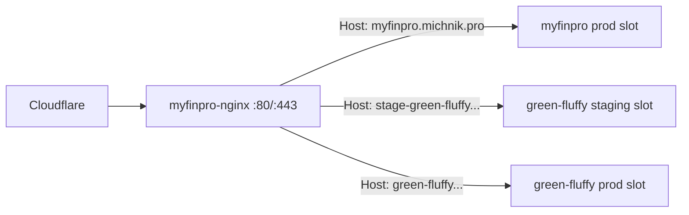

# Phase 0: Foundation — Design Document

## Table of Contents

- [Overview](#overview)
- [Reuse from myfinpro](#reuse-from-myfinpro)
- [Target Repository Layout](#target-repository-layout)
- [Naming Conventions](#naming-conventions)
- [Iteration Plan](#iteration-plan)
- [VDS & DNS Setup (0.6) in Detail](#vds--dns-setup-06-in-detail)
- [Shared Nginx Integration (0.7) in Detail](#shared-nginx-integration-07-in-detail)
- [Secrets Catalog](#secrets-catalog)
- [Testing Strategy](#testing-strategy)
- [Acceptance Checklist](#acceptance-checklist)

---

## Overview

Phase 0 stands up the entire skeleton: monorepo, empty-but-deployable API and web apps, four-locale i18n, local dev stack, CI, staging + production blue-green deployments on the shared VDS, backups, and observability. After Phase 0, every later phase is "write feature code, tests, deploy" — no infrastructure work.

**Dependencies**: none. **Everything in this phase is a port from myfinpro** — treat its repo as the reference implementation and copy deliberately, not from memory.

## Reuse from myfinpro

Copy from the sister repo (paths relative to its root), renaming `myfinpro` → `green-fluffy` and `@myfinpro/*` → `@green-fluffy/*`:

| Area           | Source paths                                                                                                                                                                                                                                                     | Notes                                                                                                                      |
| -------------- | ---------------------------------------------------------------------------------------------------------------------------------------------------------------------------------------------------------------------------------------------------------------- | -------------------------------------------------------------------------------------------------------------------------- |
| Workspace      | `pnpm-workspace.yaml`, `turbo.json`, root `package.json`, `.nvmrc`, `.prettierrc`                                                                                                                                                                                | Drop bot-related scripts for now (bot is Phase 13)                                                                         |
| Configs        | `packages/tsconfig/` (base/nestjs/nextjs/node), `packages/eslint-config/` (base/nestjs/nextjs flat configs)                                                                                                                                                      | Copy as-is                                                                                                                 |
| Shared package | `packages/shared/`                                                                                                                                                                                                                                               | Keep: locales/`isRTL`, pagination + API envelope DTOs, `API_VERSION`. Drop: `CURRENCY_CODES`. Add: `ru`, `uk` to `LOCALES` |
| API bootstrap  | `apps/api/src/main.ts`, `app.module.ts`, `config/*`, `health/*`, `common/throttler/*`, `common/decorators/throttle.decorator.ts`, `prisma/prisma.service.ts`, `prisma.config.ts`, jest configs                                                                   | Includes helmet, CORS, cookie-parser, trust-proxy (Cloudflare IPs), pino, Swagger, `/api/v1` prefix                        |
| Web bootstrap  | `apps/web/` skeleton: `[locale]` App Router layout, `src/i18n/*`, `messages/*`, Tailwind 4 setup, vitest + playwright configs                                                                                                                                    | Extend messages to 4 locales                                                                                               |
| Local stack    | `docker-compose.yml`                                                                                                                                                                                                                                             | Replace the Haraka dev container with `mailpit` for local mail catching; add media volume                                  |
| Dockerfiles    | `infrastructure/docker/{api,web}.Dockerfile`                                                                                                                                                                                                                     | Multi-stage, node 26-alpine (latest-verified), `target: production`                                                        |
| CI             | `.github/workflows/ci.yml`, `pr-check.yml`                                                                                                                                                                                                                       | Add a `gitleaks` job (new)                                                                                                 |
| CD             | `.github/workflows/deploy-staging.yml`, `deploy-production.yml`, `test-staging.yml`, `backup-verify.yml`, `infra-maintenance.yml`; `scripts/deploy.sh`, `rollback.sh`, `cleanup-images.sh`, `backup.sh`, `verify-backup.sh`, `check-backup-age.sh`, `restore.sh` | Rename all paths/containers/networks/images                                                                                |
| Compose (envs) | `docker-compose.{staging,production}.{infra,app}.yml`                                                                                                                                                                                                            | Own MySQL/Redis/Haraka per env (latest verified tags); add media bind mount to app slots                                   |
| Nginx          | `infrastructure/nginx/conf.d/ssl.conf.template`, `cloudflare-ips.conf`, `_default.conf`                                                                                                                                                                          | Rendered into the **existing shared nginx** — see below                                                                    |
| Env templates  | `.env.staging.template`, `.env.production.template`, per-app `.env.example`                                                                                                                                                                                      | Placeholder values only                                                                                                    |

## Target Repository Layout

```
green-fluffy/
  apps/
    api/            # NestJS 11 (@green-fluffy/api)
    web/            # Next.js 16 (@green-fluffy/web)
  packages/
    shared/         # @green-fluffy/shared — types, DTOs, constants, locales
    eslint-config/  # @green-fluffy/eslint-config
    tsconfig/       # @green-fluffy/tsconfig
    species-data/   # created in Phase 2 — curated species + KB dataset
  infrastructure/
    docker/         # api.Dockerfile, web.Dockerfile
    nginx/          # conf templates (rendered into shared nginx conf.d)
    haraka/         # SMTP server (ported in Phase 1.3)
    backup/         # backup helper configs
  scripts/          # deploy.sh, rollback.sh, backup.sh, ...
  docs/             # phase design docs (this directory)
  docker-compose.yml                       # local dev
  docker-compose.{staging,production}.{infra,app}.yml
  .github/workflows/
```

## Naming Conventions

| Thing             | Pattern                                                       | Examples                                                   |
| ----------------- | ------------------------------------------------------------- | ---------------------------------------------------------- |
| Docker networks   | `green-fluffy-<env>-net`                                      | `green-fluffy-staging-net`                                 |
| Containers        | `green-fluffy-<env>-<service>[-<slot>]`                       | `green-fluffy-staging-api-blue`, `green-fluffy-prod-mysql` |
| Network aliases   | `green-fluffy-<env>-<service>-<slot>`                         | upstream targets for nginx                                 |
| GHCR images       | `ghcr.io/<owner>/green-fluffy/{api,web}`                      | tags: `staging`, `staging-<sha>`, `latest`, `<sha>`        |
| Server dirs       | `/opt/green-fluffy/<env>` (+ `/opt/green-fluffy/<env>/media`) | state files `.active-slot`, `.deploy-metadata`             |
| Nginx vhost files | `green-fluffy-<env>.conf` in the shared `conf.d/`             |                                                            |
| DB names          | `green_fluffy_staging`, `green_fluffy_production`             |                                                            |

## Iteration Plan

### 0.1 Monorepo scaffold

1. Copy workspace files + `packages/{tsconfig,eslint-config,shared}` per the reuse table; global rename.
2. In `packages/shared`: `LOCALES = ['en','he','ru','uk']`, `DEFAULT_LOCALE = 'en'`, `RTL_LOCALES = ['he']`; keep `isRTL()`, pagination/API-envelope DTOs, `API_VERSION = 'v1'`; delete currency constants.
3. Root scripts: `dev`, `build`, `lint`, `typecheck`, `test*`, `db:*`, `docker:*` (mirror myfinpro's, minus bot).
4. **Done when**: `pnpm install && pnpm lint && pnpm typecheck && pnpm build` all green in a fresh clone.

### 0.2 API skeleton

1. Scaffold `apps/api` by porting myfinpro's bootstrap set (see table) — not `nest new`.
2. Prisma 7 with MariaDB driver adapter; initial schema: `HealthCheck` model only; first migration `phase0_init`.
3. Health module: `/api/v1/health` (DB ping + uptime), `/api/v1/health/ready`.
4. Swagger at `/api/docs`, gated by `SWAGGER_ENABLED`.
5. Port the custom `@CustomThrottle` decorator + in-memory throttler config.
6. **Done when**: ported unit test suite passes; `GET /api/v1/health` returns `{status:'ok'}`.

### 0.3 Web skeleton + i18n×4

1. Port `apps/web` skeleton: App Router with `[locale]` segment, next-intl middleware/config, Tailwind 4.
2. `messages/{en,he,ru,uk}.json` — seed with layout strings; `he` renders `dir="rtl"`.
3. Locale switcher + dark/light theme toggle (CSS variables, `prefers-color-scheme` default, persisted choice).
4. Placeholder landing page (project name, tagline) — this is what production serves at the end of Phase 0.
5. Add ESLint guard against hardcoded UI strings (rule or lint script) — the ×4-locale discipline starts now.
6. **Done when**: all four locales render; Vitest smoke + Playwright sample test pass.

### 0.3a UI kit foundation (added 2026-09-25)

1. Semantic, theme-aware design tokens in `globals.css` (warm leaf green + apricot accent, warm neutrals), one focus ring, one pressable utility, ripple hook, named animations, global reduced-motion rule; Rubik self-hosted (Latin, Cyrillic, Hebrew).
2. Primitives in `components/ui`: Button, LinkButton, IconButton, Spinner, Field + Input/Textarea/Select, Checkbox, Switch, Card, Badge, Chip, Alert, Toast, Dialog (native), Skeleton, EmptyState; ThemeToggle, Header, Footer, ErrorBoundary, landing and 404 restyled; skip link and `main` landmark in the layout.
3. Strings inside primitives from the `ui` namespace ×4 locales; `renderWithIntl` test helper that fails on a missing key.
4. Accessibility proof: axe in every unit spec, `jsx-a11y` lint, Playwright scan of the dev-only `/kit` showcase in 4 locales × 2 themes.
5. **Done when**: lint/typecheck/format/unit green; kit e2e green on chromium; catalogue (`wiki/ui-kit.md`), design system page and `ui-kit` skill written.

### 0.4 Local dev stack

1. Port `docker-compose.yml`: latest-verified `mysql` (9.7 LTS line), `redis`, `mailpit` (SMTP catcher, web UI), nginx (dev conf), api, web.
2. Volumes: `mysql-data`, `redis-data`, `./media-dev:/media` for the API.
3. `pnpm db:migrate`, `db:seed` (seed = health-check row for now), `db:studio` wired.
4. Document the full local loop in README (prereqs → up → migrate → seed → dev).
5. **Done when**: a fresh clone reaches a working stack with only README instructions.

**2026-09-26, owner's direction**: the local URL is the production hostname, through the infra
repo's proxy toolkit (our Mdocker): `nginx` on the external `mdock_net`, no published port, the
proxy passes the real `Host`, the browser-side API URL is relative, and `MDOCK_DEV_ORIGINS` is
loaded from the file `mdock.sh gen` derives from the registry. `http://localhost:8080` no longer
exists; `mdock.sh up` precedes `docker compose up`.

### 0.5 CI

1. Port `ci.yml`: jobs lint-and-typecheck (eslint, `tsc --noEmit`, `prettier --check`), unit-tests (`turbo run test` + coverage upload), build (`turbo run build`, includes `prisma generate`). Node 26 + pnpm cache.
2. Port `pr-check.yml`: conventional-commit PR titles (lowercase subject), changed-package detection.
3. Add `gitleaks/gitleaks-action` job (public repo hygiene); also enable GitHub secret scanning + push protection in repo settings.
4. Branch protection: `main` and `develop` require CI green.
5. **Done when**: a PR with failing lint or a fake committed secret is blocked.

### 0.6 Server provisioning + DNS (manual + documented)

See [VDS & DNS Setup](#vds--dns-setup-06-in-detail). **Done when**: subdomains resolve through Cloudflare, server dirs + networks exist, all secrets are set in GitHub environments, and `docs/server-setup-guide.md` (green-fluffy edition) documents every step.

### 0.7 Staging CD

See [Shared Nginx Integration](#shared-nginx-integration-07-in-detail). Port `deploy-staging.yml` + `scripts/deploy.sh` + compose files with these changes:

1. All names per [Naming Conventions](#naming-conventions).
2. `deploy.sh` gains an idempotent step: ensure `green-fluffy-<env>-net` exists and is connected to the `myfinpro-nginx` container (`docker network connect … || true`).
3. Nginx template rendered to the **shared** conf.d as `green-fluffy-staging.conf`; `nginx -t` inside the shared container before reload; on failure, restore previous conf (same auto-revert pattern as myfinpro).
4. Trigger: push to `develop` after CI passes (ported `workflow_run` poll).
5. **Done when**: two consecutive deploys to `stage-green-fluffy.michnik.pro` succeed with a slot flip (blue→green→blue) and zero downtime (`curl` loop during switch shows no errors), and myfinpro staging/production remain unaffected.

### 0.8 Production CD

1. Port `deploy-production.yml`: `main` branch, `production` GitHub environment (require manual approval initially), `:latest` + SHA tags, stricter env (`LOG_LEVEL=warn`, `SWAGGER_ENABLED=false`, tighter `RATE_LIMIT_MAX`, CORS locked to the prod domain).
2. Staging-tests gate: verify latest `test-staging.yml` run is green and < 24 h old (ported mechanism), plus 0.10's suites once they exist.
3. Pre-deploy dump step before `deploy.sh`: one SSH command, `/opt/shared/backup/backup.sh green-fluffy production pre-deploy` — the infra-owned tooling of 0.9, writing to `/var/backups/green-fluffy/production/pre-deploy/` (five kept). It needs no secret (the dump runs with the mysql container's own environment) and fails the deploy when the tooling is not installed. A slot rollback does not roll the database back; a release that migrated the schema is reverted by restoring this dump, then `rollback.sh`.
4. **Done when**: the production hostname serves the placeholder landing page over HTTPS and the pre-deploy dump exists on the server.

### 0.9 Backups (design 2026-09-25, owner's answers folded in — not implemented until 0.8 exists)

**State of the world (checked 2026-09-25)**: no scheduled backup runs on the shared server for any project; the crontab of the deploy user is empty, and the cron-based design ported from myfinpro (`backup.sh` + `check-backup-age.sh` in a crontab, `backup-verify.yml` restoring a fixture into a GitHub-hosted MySQL) was never installed there (infra `docs/13-deploy-runbook.md` §5, `docs/10-operations.md`). The only production backups in the shared model today are mrmichnik's pre-deploy dumps. Nothing in this project may assume a backup exists before this iteration ships, and it cannot ship before 0.8.

**Rules it follows** (infra `docs/09-secrets-and-rotation.md` §9.1a): no credentials file and no crontab line on the server; secrets are GitHub Actions secrets injected into the SSH session per run; unattended work is a scheduled workflow. The dump needs no database secret at all — it runs inside the mysql container with the container's own environment.

**Owner decisions (2026-09-25)**:

1. SSH step shape and secret names follow myfinpro: `appleboy/scp-action` + `appleboy/ssh-action` with `host` / `username` / `key` from `<ENV>_HOST`, `<ENV>_USER`, `<ENV>_SSH_KEY` (myfinpro's `deploy-production.yml`, checked 2026-09-25). Every CI here uses those names ([Secrets Catalog](#secrets-catalog)).
2. The mysql container keeps `MYSQL_ROOT_PASSWORD` and `MYSQL_DATABASE` in its environment (compose interpolates them from the injected secrets at deploy time) — confirmed; the dump relies on it.
3. Backups are never part of the project: the files live outside `/opt/green-fluffy`, and nothing backup-related is committed to this repository beyond the one pre-deploy call in 0.8.
4. The tooling is reusable and lives in the infra repo, for every project on the shared server.
5. Same-disk backups (no off-site copy) are accepted for now.

**Where things live**:

- **Tooling — infra repo `backup/`**: `backup.sh` (one script for every project) and `projects.conf` (one line per project × environment: mysql container name, media directory, retention overrides), plus `.github/workflows/backup.yml` (`schedule` daily off-peak UTC, `workflow_dispatch` with `project`, `environment`, `mode`). Same shape as infra's `certs.yml`: checkout → `scp-action` ships `backup/` to `/opt/shared/backup/` (the repo is the source of truth; the server copy is derived and refreshed on every run, so nothing on the server goes stale) → `ssh-action` runs it with infra's own deploy-key triple (the myfinpro `host` / `username` / `key` shape, one environment).
- **Why a server-installed script and not a reusable workflow or action from infra**: GitHub shares a private repository's actions and reusable workflows with the owner's _private_ repositories only (REST docs, `access_level: user`, checked 2026-09-25); infra's access level is `none` today and this repository is public. A called workflow's `actions/checkout` also checks out the caller, not the called repository. The script on the server needs no cross-repo access and no extra token.
- **Files — `/var/backups/<project>/<env>/{daily,weekly,pre-deploy}/`**, outside every project tree, where myfinpro's `docs/backup.md` and mrmichnik's plan put theirs. The script creates `/var/backups/<project>` on its first run (`sudo install -d` owned by the deploy user, who can sudo on the shared server per the infra records of 2026-09-24 — _not re-verified on the server this session_), so 0.6 gains no manual step.
- **This repository**: one call. 0.8's production workflow runs `/opt/shared/backup/backup.sh green-fluffy production pre-deploy` over SSH before `deploy.sh`, without secrets, and fails the deploy when the tooling is absent — backups are installed before the first production deploy, not after.

**What the tooling does**, per registered project × environment (`daily` by infra's schedule, `pre-deploy` by a project's deploy, `drill` on the Sunday run and on dispatch):

- **Dump inside the container**: `docker exec <mysql container> sh -c 'MYSQL_PWD="$MYSQL_ROOT_PASSWORD" mysqldump -uroot --single-transaction --no-tablespaces --routines --triggers --set-gtid-purged=OFF "$MYSQL_DATABASE"' | gzip > …/db-<UTC stamp>.sql.gz.tmp`. Credentials come from the container's environment, never from the command line or a file. Verified 2026-09-25 on the local `mysql:9.7` container: `mysqldump 9.7.1` honours `MYSQL_PWD`; without `--set-gtid-purged=OFF` it prints a GTID warning.
- **Media**: `tar czf …/media-<stamp>.tar.gz -C <project env dir> media` — a daily full archive while media is small; the script logs `du -sh` of media and `df -h` of the backup root and fails when free space is below twice the previous archive size. Switch to incremental archives when the baseline says so (record it in the progress log).
- **Integrity on every file**: non-empty, `gzip -t`, and for the dump the trailing `-- Dump completed` marker; the `.tmp` is renamed into place only after all three pass, so a listing never contains a broken file.
- **Retention 7 daily / 4 weekly**: the Sunday run hard-links its two files into `weekly/`; prune to the newest 7 in `daily/` and 4 in `weekly/`, after the new files are in place, never before. `pre-deploy/` keeps 5.
- **Age check = the alert**: the run fails when, for any registered project × environment, the newest `daily/db-*.sql.gz` or `daily/media-*.tar.gz` is older than 26 h (skipped only on the first ever run of an environment); the red scheduled run in the infra repo is the notification. GitHub sends scheduled-workflow notifications to the user who last modified the cron line in the workflow file (GitHub docs, "Events that trigger workflows", checked 2026-09-25), so the owner commits that line. The rule that disables scheduled workflows after 60 days without repository activity applies to public repositories only; infra is private.
- **Weekly restore drill on the server** (`drill`): create scratch schema `<db>_restore_drill` in the same mysql container, `gunzip -c <newest dump> | docker exec -i … mysql`, compare `SELECT COUNT(*) FROM _prisma_migrations` (or the project's equivalent table from `projects.conf`) with the live schema, `tar tzf` the newest media archive; drop the scratch schema in a `trap` so it is gone even when the drill fails. No GitHub-hosted MySQL, no fixture: the drill restores the real dump where it would be restored for real.

**Out of 0.9** (moved from the ported list): structured pino logs already ship (0.2); deploy notifications are the workflow run status (no Telegram webhook, no extra secret); image pruning is the deploy's `cleanup-images.sh` in the shared pattern; disk checks live in the backup script.

**Green-fluffy's 0.9 iteration is therefore**: (a) a PR to infra adding the two `green-fluffy` lines (staging, production) to `backup/projects.conf` — owner-reviewed, infra is private and owner-operated; (b) the pre-deploy call in 0.8's workflow; (c) verification of the first scheduled run, a drill and a forced age-check failure for green-fluffy; (d) this section, `wiki/deployment.md` and the progress log updated with dated results. The tooling itself is infra's work and must exist first — myfinpro and mrmichnik need it today (infra doc 13 §5), so it is built for them before green-fluffy is deployed.

**Needs from infra before it can be built**: `backup/{backup.sh,projects.conf}` + `backup.yml` as above, the entry format of `projects.conf`, and the Phase 5 deploy template for 0.8 with the myfinpro-shaped SSH step. Everything else is decided.

**Done when** (after 0.8): a scheduled infra run produced a dump and a media archive for each green-fluffy environment under `/var/backups/green-fluffy/` and pruned to the retention; a drill restored the newest dump and the counts matched; the age check demonstrably fails (rename the newest dump, dispatch → red; rename back → green); the deploy user's crontab is still empty and no credentials file exists on the server; `git grep -i backup` in this repository finds only the pre-deploy call and documentation.

### 0.10 Staging smoke tests

1. Port `test-staging.yml` + minimal suites: API staging tests (health, api root, docs gated off, rate limiting) and Playwright staging E2E (landing renders in 4 locales, API proxy works, responsive layout).
2. Wire as production gate (see 0.8).
3. **Done when**: suite auto-runs after staging deploy and its result gates production.

## VDS & DNS Setup (0.6) in Detail

On the VDS (same host as myfinpro; you already have SSH):

```bash
sudo mkdir -p /opt/green-fluffy/{staging,production}/media
sudo chown -R deploy:deploy /opt/green-fluffy            # same deploy user as myfinpro
docker network create green-fluffy-staging-net
docker network create green-fluffy-production-net
```

Cloudflare (michnik.pro zone): add `A`/`CNAME` records `stage-green-fluffy` and `green-fluffy` → VDS IP, proxied (orange cloud), TLS mode matching myfinpro's current setting. Mail DNS (SPF/DKIM/DMARC for the mail domain) is Phase 1.3, not here.

GitHub repo settings: create `staging` and `production` environments; add the [secrets catalog](#secrets-catalog); enable secret scanning + push protection; add branch protections.

Resource check before first deploy: `free -h`, `df -h`, `docker stats --no-stream` — record baseline in the setup guide; green-fluffy adds ~4 containers per env plus media storage. If RAM is tight, consolidating MySQL instances is the documented fallback (plan §8.2).

## Shared Nginx Integration (0.7) in Detail

Current VDS state (from myfinpro): container `myfinpro-nginx` (nginx:1.28-alpine, compose project `myfinpro-shared`) binds 80/443, mounts `conf.d/` from `/opt/myfinpro/shared/nginx/conf.d/`, and routes by `Host` header with env-prefixed upstreams and an `_default.conf` catch-all (unknown hosts → 444).

Green-fluffy plugs in without touching the myfinpro repo:


```mermaid
flowchart LR
  cf[Cloudflare] --> ng[myfinpro-nginx :80/:443]
  ng -->|Host: myfinpro.michnik.pro| mfp[myfinpro prod slot]
  ng -->|Host: stage-green-fluffy...| gfs[green-fluffy staging slot]
  ng -->|Host: green-fluffy...| gfp[green-fluffy prod slot]
```

1. Vhost template `infrastructure/nginx/conf.d/green-fluffy.conf.template` (fork of myfinpro's `ssl.conf.template`): upstreams `green_fluffy_${ENVIRONMENT}_api` → `green-fluffy-${ENVIRONMENT}-api-${ACTIVE_SLOT}:3001` and `..._web` → `...-web-${ACTIVE_SLOT}:3000`; routes `/api/` → api, `/` → web; `client_max_body_size 110M` (media uploads); `server_name` from secret.
2. Deploy script: `envsubst` render → copy to `/opt/myfinpro/shared/nginx/conf.d/green-fluffy-${ENVIRONMENT}.conf` → `docker exec myfinpro-nginx nginx -t` → reload; keep previous conf for auto-revert.
3. Network attach (idempotent, in `deploy.sh`): `docker network connect green-fluffy-${ENVIRONMENT}-net myfinpro-nginx 2>/dev/null || true`.
4. **Cross-repo chore (backlog)**: migrate the shared nginx to a neutral compose project (e.g. `/opt/shared/nginx`) declared in both repos' docs; until then the coupling is one `docker network connect` + one conf file, both owned by green-fluffy's deploy script.
5. Rollback: `rollback.sh` re-renders conf for the previous slot — same auto-revert-on-failed-verify behavior as myfinpro.

## Secrets Catalog

Names only (values live in GitHub environment secrets; templates committed with placeholders):

- **SSH/deploy**: `STAGING_HOST`, `STAGING_USER`, `STAGING_SSH_KEY`, `PRODUCTION_*` variants (same VDS → same values, still separate secrets for future split). Identical to myfinpro's workflow secret names (checked 2026-09-25) — the owner's rule for every CI here.
- **Domains**: `CLOUDFLARE_STAGING_SUBDOMAIN` (= `stage-green-fluffy.michnik.pro`), `CLOUDFLARE_PRODUCTION_SUBDOMAIN`.
- **DB**: `MYSQL_ROOT_PASSWORD`, `MYSQL_DATABASE`, `MYSQL_USER`, `MYSQL_PASSWORD` (per env).
- **Auth**: `JWT_SECRET`, `JWT_REFRESH_SECRET`, `SESSION_SECRET`, `COOKIE_SECRET` (per env, generated fresh — never reuse myfinpro's).
- **OAuth/Telegram** (created in Phase 1): `GOOGLE_CLIENT_ID`, `GOOGLE_CLIENT_SECRET`, `GOOGLE_CALLBACK_URL`, `TELEGRAM_BOT_TOKEN[/_STAGE]`, `TELEGRAM_BOT_USERNAME[/_STAGE]`, `NEXT_PUBLIC_TELEGRAM_BOT_ID`.
- **Mail** (Phase 1): `SMTP_HOST/PORT/SECURE/USER/PASS/FROM`, `MAIL_DOMAIN`, `DKIM_PRIVATE_KEY`.
- **Runtime**: `RATE_LIMIT_*`, `LOG_LEVEL`, `SWAGGER_ENABLED`, `REDIS_URL`, `MEDIA_ROOT`, `MEDIA_QUOTA_DEFAULT_BYTES`.

## Testing Strategy

- Ported unit tests must pass at each iteration (0.1–0.3).
- CI is itself under test: verify each job fails correctly (introduce a deliberate lint error / fake secret on a branch).
- Deploy verification: scripted `curl` loop during slot switch (zero non-2xx), health endpoints post-deploy, myfinpro unaffected (its health endpoints checked in green-fluffy's deploy smoke step during Phase 0 only).
- Backup restore drill on the server into a scratch schema of the real mysql container (0.9), on a weekly schedule.

## Acceptance Checklist

- [ ] Fresh clone → running local stack using only README
- [ ] CI blocks bad PRs (lint, types, tests, secrets, PR title)
- [ ] `stage-green-fluffy.michnik.pro` + `green-fluffy.michnik.pro` live, HTTPS, 4 locales, dark/light
- [ ] Two consecutive zero-downtime blue-green deploys per environment
- [ ] Rollback drill executed successfully on staging
- [ ] Backups (0.9): scheduled workflow dumps DB + media, restore drill passes, age check fails the run; no crontab, no credentials file on the server
- [ ] myfinpro staging + production verified unaffected
- [ ] No secret values anywhere in the repo (gitleaks green from the first commit)
